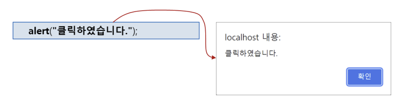
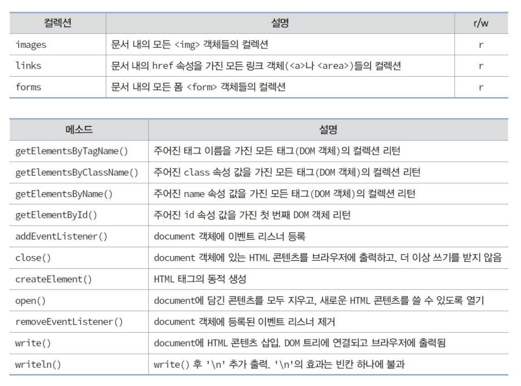

# 웹응용프로그래밍 javascript/html/css 필기
> 미친 300장 짜리 ppt를 간단하게 정리해보겠습니다.
## ☝🏻 javascript
### 역할
- **동적 제어**
    - HTML, CSS 등을 동적으로 변경
- **이벤트 처리**
    - 클릭, 키입력과 같은 이벤트에 대한 응답
- **브라우저 제어**
    - 윈도우크기 모양제어, 새 윈도우 열기/닫기
    - 다른 웹 접속, 히스토리 제어
- **웹서버와 통신**
- **웹 어플리케이션 작성**

### 위치
1. **html태그의 이벤트 리스너 attribute**
    - ex) `` :
        - `onclick` : 이벤트 리스너 속성
            - `onmouseover`, `onmouseout`, ...
        - `"this.src='b.png'"` 부분이 자바스크립트코드 (사진 교체)
            - `this` : 현재 img태그를 가리키는 자바스크립트 키워드
        > **event** : 사용자의 입력동작을 브라우저가 감지해 웹페이지에 전달

        > **event listner** : 이벤트를 처리하는 자바스크립트 코드

2. **`<script></script>`**
    - 자바스크립트 함수는 자바스크립트 코드 블록으로 **호출**될때 실행됨.
    

3. **별도 js파일에**
    - `"-.js"`에 만들고, `<script src="location/-.js"></script>` 로 파일 불러 사용
4. **URL 부분**
    - 코드앞에 `javascript:`표시 -> 일반 url과 구분하기 위해
    

### HTML 콘텐츠 출력

|코드|설명|예시|
|---|---|---|
|`document.write()`|브라우저 윈도우내 해당 코드가 실행되는 위치에 출력|`document.write("<h3>hi</h3>")`|
|`document.writeln()`|`\n`와 함께 출력|`document.writeln("<h3>hi</h3>")`|
|`documant.getElementById("demo").innerHTML`|특정 요소에 출력||
|`prompt("메세지","입력창 디폴트 입력값")`|사용자로부터 **문자열**을 입력받아 리턴하는 다이얼로그 표시||
|`confirm("메세지")`|메세지를 출력하고 확인/취소 버튼을 가진 다이얼로그 표시||
|`alert("메세지")`|메시지와 확인버튼을 가진 다이얼로그 표시||

## Data Types and Variables
- 주석
    - HTML : `<!--...-->`
    - CSS : `/*...*/`
    - JS : `//` , `/*...*/`

> **null** != NULL

### 조건연산자
- `condition ? expT : expF`

## Loop Statements


## Functions
```js
//기본(c==js)
function func1(arg1, arg2, arg3){
    return arg1+arg2+arg3;
}

//함수 표현식
let func2 = function(arg1, arg2, arg3){
    return arg1+arg2+arg3;
}
```

|코드|설명|예시|
|---|---|---|
|**`eval(exp)`**|exp의 자바스크립트 식을 계산하고 결과 리턴|`let res = eval("2*3+4*6");`|
|**`parseInt(str,radix)`**|str 문자열을 10진 정수로 변환하여 리턴(radix option넣으면 radix진수로 해석하고 10진수로 바꾸어 리턴)||
|`parseFloat(str)`|문자열을 실수로 바꿔 리턴||
|**`isNaN(value)`**|value가 숫자가 아니면 true 리턴||
|`isFinite(value)`|value가 숫자면 ture 리턴||

## Objects
- 여러 하위 값과 함수를 저장
    - ex) var myCar = {maker:"hy",model:"gfs",color:"white",price:5000};
- property : 객체가 가질 수 있는 속성 (변수)
    - `객체명.속성명`
    - `객체명[속성명]`
- method : 객체가 취할 수 있는 동작 (함수)


- creation/deletion


## JS 객체유형
1. 코어객체
    - 별도 link나 외부 js파일없이도 실행가능
    - Arrary, Date, String, Math
2. 문서객체
3. 브라우저객체

## 1. 코어객체 (ECMAScript spec일부)
### 코어 객체생성
- new 키워드 이용, 객체생성되면 객체내부에 property와 method들이 존재
    ```js
    let today = new Date();
    let msg = new String("Hello");
    ```
### 객체 접근
- 객체와 멤버 사이에 `.`연산자 사용
    ```js
    obj.프로퍼티 = 값;
    변수 = obj.프로퍼티;
    obj.메소드(매개변수 값);
    ```

    

### Array 객체
- 크기 고정x 계속 늘어남 
1. `[]`로 배열 선언 및 초기화
2. `new Array()`로 배열 선언 및 초기화
    - 초기값을 가진 배열
        - ex) `let week = new Array("월","화","수","목","금","토","일");`
    - 초기화되지 않은 배열
        ```js
        let week = new Array(7);
        week[0]='월';
        //...
        week[6]='일';
        ```
    - 빈 배열 생성, 추가
        ```js
        let week = new Array();
        week[0] = '월'; //자동으로 크기 1증가
        ```
- 배열의 크기
    - `arr.length=10` : 이런식으로 크기 변경도 가능 (이후 값 자동 삭제됨)

- Array 메서드

    |메소드|설명|
    |--|--|
    |concat(arr)|현재배열에 arr를 덧붙여 만든 새 배열 리턴, 현재 배열 변화 x|
    |join([seperator])|모든 원소를하나로 연결해 문자열로 만들어 리턴, separator(",")를 삽입해 문자열 리턴|
    |reverse()|역순 재배치|
    |slice(,)|자르기|
    |sort()|사전순 정렬|
    |toString()|하나로 연결해 문자열로 만들어 리턴, ","삽입|
### Date 객체
- 시간 정보를 담는 객체
- Date 객체 활용
    ```js
    let now = new Date();
    let date = now.getDate();
    let hour = now.getHours();
    ```

    

### String 객체
- 문자열을 담기위한 객체, 수정불가
- String 객체 생성 방법
    ```js
    let hello = new String("hello");
    //or
    let hello = "Hello";
    ```
    

### Math 객체
- 수학 계산을 위한 객체
- 객체 생성안해도됨 
    ```js
    let sq = Math.sqrt(4);
    let area = Math.PI*2*2;
    Math.random()*100;  //0~1 *100
    Math.floor(m);
    //...
    ```
    

### 사용자 객체 
- 사용자 객체 만드는방법
    - 직접 객체 정의
        1. `new Object()`로 빈객체 생성 
            - {}라고만해도 동일한 의미
        2. 빈 객체에 프로퍼티 추가
        3. 빈 객체에 메소드 추가
            - 메소드로 사용할 함수 미리 작성
            - 새 메소드 추가
        
        ```js
        let account = new Object(); // 1. 빈 객체 생성
        account..owner = "이유진";  // 2. 프로퍼티 생성
        account.code=1111;  // 프로퍼티 생성
        account,inquiry = inquiry   // 3. 메소드 작성
        ```
    - 리터럴 표기법으로 만들기
        ```js
        //프로퍼티 생성 및 초기화
        let account = {
            owner : "이유진",   //프로퍼티 추가
            code: 1111
            balance:35000,

            //메소드 작성
            inquiry:function(){return this.balance;},
            deposit:function(money){this.balance+=money;},
            withdraw:function(money){
                this.balance-=money;
                return money;
            }
        };
        ```
    - 프로토타입으로 만들기
    > 프로토타입 : 객체의 모양을 가진 틀

    - 객체 생성시 `new 프로토타입`으로 만들기
       

## 2. 문서객체 (DOM - Document Object Model : 웹브라우저에서 제공되는 API)
- HTML문서에 작성된 각 HTML태그들을 객체화한것, HTML문서내용모양 제어

### DOM 객체의 구성요소
- property 
    - DOM 객체의 속성으로, 대응되는 HTML element 의 속성을 제어
- method 
    - DOM 객체의 멤버함수로서, 대응되는 HTML element 제어
- collection
    - 자식 DOM 객체들의 주소를 가지는 등 배열과 비슷한 집합적 정보
- event listener
    - html element에 명시된 이벤트 리스터 속성 반영
- css3스타일


```js
let p = document.getElementById("id2"); //id가 id2인 태그의 DOM찾기
p.style.color = "red";
```
### innerHTML 프로퍼티
- 시작 태그과 종료태그 사이에 작성된 HTML 콘텐츠


- innterHTML 프로퍼티 수정 -> HTML 태그 요소 콘텐츠 수정


### this


### document 객체
- HTML 문서 전체를 대번하는 객체
- DOM의 EP(entry point)로 웹 모든 요소에 접근할 수 있게 해주는 DOM 객체
- DOM 의 최상위 객체로 window.document나 document둘중 하나로 접근가능
- document.style.color 이딴거 안됨. (일반 DOM은 가능)




### DOM트리에서 DOM 객체찾기
- 태그이름으로 찾기
    - `document.getElementsByTagName("div")`
- class속성으로 찾기
    - `document.getElementsByClassName("plain")`

### HTML 페이지 로딩과정
1. 브라우저는 HTML 페이지 로드 전 빈 상태의 document를 생성
2. 브라우저는 HTML 페이지를 위에서아래로 해석
3. HTML 태그들을 document 객체에 담음 (DOM 객체 생성)
4. </html> 태그를 만나면 document 객체를 완성후 닫음

#### document.write() 
- HTML 젤 마지막에 추가
- 추가되는 HTML 태그들은 DOM 객체로 바뀌고 DOM 트리에 추가
#### document.writeln()
- HTML 텍스트에 \n을 덧붙여 출력 (빈칸하나)

### document 열기/닫기
#### document.open()
- 현재브라우저에 출력된 HTML콘텐츠를 지우고 새로운 HTML 페이지 시작
    - document객체에 담근 DOM 트리를 지우고 새로시작
#### document.close()
- 현재 브라우저에 출력된 HTML 페이지 완성
- 더이상 document.write()할 수 없음

```html
<!--ex8-10.html 문서작성기 만들기-->

<!DOCTYPE html>
<html>
<head>
<title>HTML 문서 작성기 만들기</title>
<script>
    let win = null;
    function showHTML(){
        if(win==null||win.closed)
            win = window.open("","outWin","width=300,height=200");
        
        let textArea = document.getElementById("srcText");
        win.document.open();
        win.document.write(textArea.value);
        win.document.close();
    }
</script>
</head>
<body>
    <h3>HTML 문서 작성기 만들기</h3>
    <hr>
    <p>아래에 HTML문서를 작성하고 버튼을 누르면, 새로운 윈도우에 HTML 문서가 출력된다.</p>
    <textarea id="srcText" rows="10" cols="50"></textarea>
    <br>
    <br>
    <button onclick="showHTML()">HTML 문서 출력하기</button>
</body>
</html>
```

### 문서 동적 구성
#### DOM 객체 동적 생성 : `document.createElement("태그명")`
- 태그명의 DOM 객체 생성
```js
let newDiv = document.createElement("div");
newDiv.innterHTML = "새로생성된 div";
newDiv.setAttribute("id","mydiv");
newDiv.style.color-"yellow";
```

#### DOM 트리에 삽입
- `부모.appendChild(DOM객체)`
- `부모.insertBefore(DOM객체[,기준자식])`
```js
let p = document.getElementById("p");
p.appendChild(newDiv);
```

#### DOM 객체 삭제
- `let removedObj = 부모.removeChild(떼어내고자하는자식객체)`
```js
let mydiv = document.getElemnetById("mydiv");
let parent = mydiv.parentElement;
parent.removeChild(mydiv);
```

```html
<!-- ex08-11 태그의 동적 추가 삭제 -->

<!DOCTYPE html>
<html>
    <head>
        <script>
            function createDiv(){
                let obj = document.getElementById("parent");
                let newDiv = document.createElement("div");
                newDiv.innerHTML = "새로생성된 div";
                newDiv.setAttribute("id","mydiv");
                newDiv.onclick = function(){
                    let p = this.parentElement;
                    p.removeChild(this);
                };
                obj.appendChild(newDiv);
            }
        </script>
    </head>
    <body id="parent">
        <a href="javascript:createDiv()">div 생성</a>

    </body>
</html>
```


## 3. 브라우저 객체 (BOM - Browser Object Model : 웹브라우저에서 제공되는 API)
- 자바스크립트로 브라우저 제어
### BOM (Browser Object Model) objects
- 자바스크립트로 브라우저 제어를 위해 사용, html내용과 관련 x, 표준없음
#### 브라우저별 공통 BOM object
- window
- navigator
- history
- location
- screen

### Window 객체
- 열려있는 브라우저 윈도우나 탭윈도우의 속성을 나타내는 객체
- 윈도우마다 별도의 window 객체 생성

#### window 객체가 생성되는 경우
1. 브라우저가 새로운 웹 페이지를 로드 시
2. `<iframe>`태그가 로드시 +1
3. `window.open("url","윈도우이름","윈도우속성")` 이 js코드 새 윈도우 열때 해당 window의 객체 리턴

#### js로 window접근방법
- window 
- window.self
- self
- 생략도 가능 (window.~~~안해도됨)


#### window open method
- `window.open("url",윈도우명,모양크기등의속성,,,)`
    - 새 브라우저 윈도우를 열고 웹 페이지 출력


#### window close method
- `window명.close()`
    - 해당 윈도우 객체가 가리키는 윈도우가 닫힘

    ```html
    <!-- ex10-2.html 윈도우 열고 닫기-->

    <!DOCTYPE html>
    <html>
        <head>
            <script>
                let newWin = null;
                function load(URL){
                    newWin = window.open(URL,"myWin","left=300");
                }
                function closeNewWindow(){
                    if(newWin == null || newWin.closed) return;
                    else newWin.close();    //열어놓은 윈도우닫기
                }
            </script>
        </head>
        <body>
            <a href="javascript:load('http://www.disneyworld.com')">새 윈도우 열기</a>
            <a href="javascript:window.close()">현재 윈도우 닫기</a>
            <a href="javascript:closeNewWindow()">새 윈도우 닫기</a>
        </body>
    </html>
    ```

#### window Timer Method
- window 객체의 메소드지만, 일반적으로 객체 이름을 생략하고 씀
- 지정된 milliseconds 이후 호출되는 timer
    - `setTimeout()`
    - `clearTimeout()`

    ```js
    let timeID = setTimeout(alert(hi),100);  //1초후 경고
    clearTimeout(timeID)
    ```

- 지정된 milliseconds마다 반복 호출되는 timer ...위에코드처럼 써주면됨
    - `setInterval()`
    - `clearInterval()`

#### window 위치 및 크기 조절 
```html
<!-- ex10-5.html 윈도우 위치 크기 조절 -->

<!DOCTYPE html>
<html>
    <head></head>
    <body>
        <h3>윈도우 위치 크기 조절</h3>
        <hr>
        <button onclick="window.moveBy(-10,0)">left</button>
        <button onclick="window.moveBy(10,0)">right</button>
        <button onclick="self.moveBy(0,-10)">up</button>
        <button onclick="moveBy(0,10)">down</button>
        <button onclick="window.resizeBy(10,10)">+</button>
        <button onclick="window.resizeTo(self.outerWidth-10,self.outerHeight-10)">-</button>
    </body>
</html>
```

#### 웹 스크롤
```html
<!DOCTYPE html>
<html>
    <head>
        <script>
            function startScroll(interval){
                setInterval("autoScroll()",interval);
            }

            function autoScroll(){
                window.scrollBy(0,10);
            }
        </script>
    </head>
    <body onload="startScroll(1000)">
        <h3>
            <!--내용-->
        </h3>
    </body>
</html>
```

#### 웹 페이지 프린트
- `window.print()` : 이코드 실행시 인쇄창 표시
1. window객체에 onbeforeprint리스너 호출    :로고 보임
2. 웹페이지 프린트
3. window객체에 onafterprint리스너 호출 : 로고 안보임

### location
- 윈도우에 로드된 웹 페이지의 URL 정보를 나타내는 객체
```js
//location 객체를 사용하여 현재 윈도우에 웹 페이지 로드
window.location = "http://www.naver.com";
window.location.href = = "http://www.naver.com";
window.location.assign("http://www.naver.com");
window.location.replace("http://www.naver.com");

//새 윈도우에 웹 페이지 로드
let win=window.open(); // 빈 윈도우 열기
win.location="http://www.naver.com"; // 네이버 페이지 로드

```


### navigator
- 브라우저에 대한 다양한 정보를 포함하는 객체


### screen
- 브라우저가 실행되는 스크린 장치(디스플레이 설정)에 대한 정보를 포함하는 객체


### history


